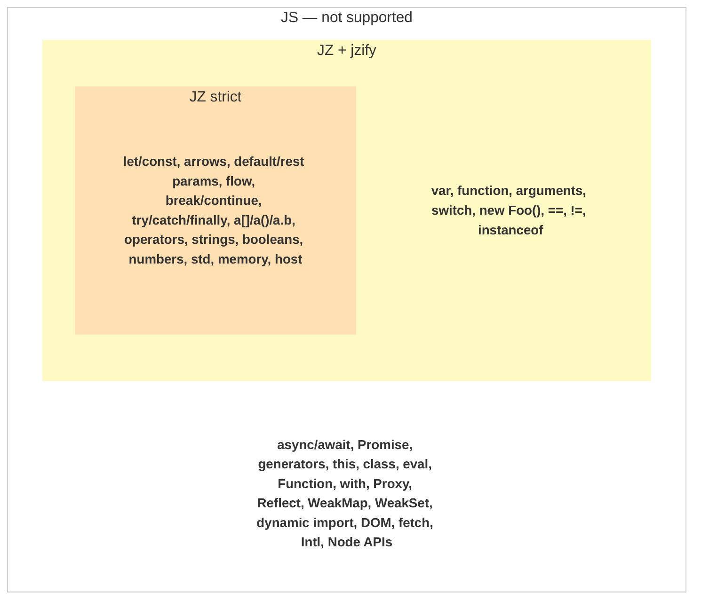

##  [](http://npmjs.org/jz) [](https://github.com/dy/jz/actions/workflows/test.yml)


**JZ** (_javascript zero_) is **minimal modern functional JS subset**, compiling to WASM.<br/>

```js
import jz from 'jz'

// Distance between two points
const { exports: { dist } } = jz`export let dist = (x, y) => (x*x + y*y) ** 0.5`
dist(3, 4) // 5
```

## Why?

**Write plain JS, compile to WASM** – fast, portable and long-lasting.<br>
JZ distills the modern functional core – the "good parts" ([Crockford](https://www.youtube.com/watch?v=_DKkVvOt6dk)) – from legacy semantics, features overhead and perf quirks.

* **Static AOT** – no runtime, no GC, no dynamic constructs.
* **Valid jz = valid js** — test in browser, compile to wasm.
* **Minimal** — output is close to hand-written WAT.
<!-- * **Realtime** — compiles faster than `eval`, useful for live-coding and REPL. -->

| Good for                    | Not for                    |
|-----------------------------|----------------------------|
| Numeric / math compute      | UI / frontend              |
| DSP / audio / bytebeats     | Backend / APIs             |
| Parsing / transforms        | Async / I/O-heavy logic    |
| WASM utilities              | JavaScript runtime         |

Inspired by [porffor](https://github.com/CanadaHonk/porffor) and [piezo](https://github.com/dy/piezo).
<!-- Used internally by: web-audio-api, color-space, audiojs -->


## Usage

```js
import jz, { compile } from 'jz'

// Compile, instantiate
const { exports: { add } } = jz('export let add = (a, b) => a + b')
add(2, 3)  // 5

// Compile only — returns raw WASM binary (no JS adaptation)
const wasm = compile('export let f = (x) => x * 2')
const mod = new WebAssembly.Module(wasm)
const inst = new WebAssembly.Instance(mod)

// Async WASM startup — jz source compilation is still synchronous
const asyncInst = compile('export let f = (x) => x * 2')
asyncInst.exports.f(21) // 42
```

## CLI

`npm install -g jz`

```sh
# Compile
jz program.js # → program.wasm

# Evaluate
jz -e "1 + 2" # 3

# Show help
jz --help
```

## Language

JZ is a strict functional JS subset. Built-in `jzify` transform extends support to legacy patterns.

<!--

-->

```
┌────────────────────────────────────────────────────────────────────────┐
│ JZify                                                                  │
│   var  function  arguments  switch  new Foo()                          │
│   ==  !=  instanceof  undefined                                        │
│                                                                        │
│ ┌────────────────────────────────────────────────────────────────────┐ │
│ │ JZ                                                                 │ │
│ │   let/const  =>  ...xs  destructuring  import/export               │ │
│ │   if/else  for/while/do-while/of/in  break/continue                │ │
│ │   try/catch/finally  throw                                         │ │
│ │   operators  strings  booleans  numbers  arrays  objects  `${}`    │ │
│ │   Math  Number  String  Array  Object  JSON  RegExp  Symbol  null  │ │
│ │   ArrayBuffer  DataView  TypedArray  Map  Set                      │ │
│ │   console  setTimeout/setInterval  Date  performance               │ │
│ └────────────────────────────────────────────────────────────────────┘ │
└────────────────────────────────────────────────────────────────────────┘
Not supported
  async/await  Promise  function*  yield
  this  class  super  extends  delete  labels
  eval  Function  with  Proxy  Reflect  WeakMap  WeakSet
  dynamic import  DOM  fetch  Intl  Node APIs
```
## FAQ

<details>
<summary><strong>How to pass data between JS and WASM?</strong></summary>

<br>


Numbers pass directly as f64, arrays of ≤ 8 elements return as plain JS arrays (multi-value). Strings, arrays, objects, and typed arrays are heap values — `inst.memory` provides read/write across the boundary:

```js
const { exports, memory } = jz`
  export let greet = (s) => s.length
  export let sum = (a) => a.reduce((s, x) => s + x, 0)
  export let dist = (p) => (p.x * p.x + p.y * p.y) ** 0.5
  export let rgb = (c) => [c, c * 0.5, c * 0.2]
  export let process = (buf) => buf.map(x => x * 2)
`

// JS → WASM (write)
memory.String('hello')               // → string pointer
memory.Array([1, 2, 3])              // → array pointer
memory.Float64Array([1.0, 2.0])      // → typed array pointer
memory.Int32Array([10, 20, 30])      // all typed array constructors available

// ⚠ Objects: keys and order must match the jz source declaration.
// jz objects are fixed-layout schemas (like C structs), not dynamic key bags.
// If the jz source declares `{ x, y }`, you must pass `{ x, y }` in that order.
memory.Object({ x: 3, y: 4 })       // → object pointer

// Strings/arrays inside objects are auto-wrapped to pointers:
memory.Object({ name: 'jz', count: 3 })  // name auto-wrapped via memory.String

// Call with pointers
exports.greet(memory.String('hello'))          // 5
exports.sum(memory.Array([1, 2, 3]))           // 6
exports.dist(memory.Object({ x: 3, y: 4 }))   // 5

// direct JS array return
exports.rgb(100)      // [100, 50, 20]

// read pointer value
memory.read(exports.process(memory.Float64Array([1, 2, 3])))  // Float64Array [2, 4, 6]
```

Template interpolation handles most of this automatically — strings, arrays, numbers, and numeric objects are marshaled for you:

```js
jz`export let f = () => ${'hello'}.length + ${[1,2,3]}[0] + ${{x: 5, y: 10}}.x`
```

<!--
### How does everything fit in f64?

All values are IEEE 754 f64 (at WASM boundary). Integers up to 2^53 are exact. Heap types use [NaN-boxing](https://nachtimwald.com/2019/11/06/nan-boxing/): quiet NaN (`0x7FF8`) + 51-bit payload `[type:4][aux:15][offset:32]`.

| Type | Code | Payload | Example |
|------|------|---------|---------|
| Number | — | regular f64 | `3.14`, `42`, `NaN` |
| Null | 0 | reserved pattern | `null` (distinct from `0` and `NaN`) |
| Array | 1 | aux=length, offset=heap | `[1, 2, 3]` |
| ArrayBuffer | 2 | offset=heap | `new ArrayBuffer(16)` |
| TypedArray | 3 | aux=elemType, offset=heap | `new Float64Array(n)` |
| String | 4 | offset=heap | `"hello world"` (>4 chars) |
| SSO String | 5 | aux=packed chars | `"hi"` (<=4 ASCII chars, zero alloc) |
| Object | 6 | aux=schemaId, offset=heap | `{x: 1, y: 2}` |
| Hash | 7 | offset=heap | dynamic string-keyed objects |
| Set | 8 | offset=heap | `new Set()` |
| Map | 9 | offset=heap | `new Map()` |
| Closure | 10 | aux=funcIdx, offset=env | `x => x + captured` |
| External | 11 | offset=hostMap index | JS host object references |

**Why NaN-boxing?** used by LuaJIT, JavaScriptCore, SpiderMonkey. The alternatives — tagged unions (OCaml, Haskell), pointer tagging (V8 Smis), or separate type+value pairs — all require branching at call boundaries or multi-word passing. NaN-boxing fits any value in one 64-bit word: one calling convention, one memory layout, one comparison instruction.

**The f64 tradeoff**: f64 arithmetic is ~1.2x slower than i32 for pure integer work on most architectures. jz mitigates this — `analyzeLocals` preserves i32 for loop counters, bitwise ops, and comparisons, so the penalty only applies to mixed-type parameters. The gain: zero interop cost at the JS↔WASM boundary (f64 is WASM's native JS-compatible type), no marshaling, no boxing/unboxing. For jz's target workloads (DSP, typed arrays, math), f64 is the natural type anyway.

**NaN preservation**: IEEE 754 defines 2^52 − 1 distinct NaN bit patterns. WASM preserves NaN payload bits through arithmetic (spec requires `nondeterministic_nan`), and JS engines canonicalize only on certain operations (`Math.fround`, structured clone). jz uses quiet NaNs (`0x7FF8` prefix) which survive all standard paths. The 51 payload bits encode type (4), aux metadata (15), and heap offset (32) — enough for 4GB addressable memory and 12 type codes.
-->

</details>

<details>
<summary><strong>How does template interpolation work?</strong></summary>

<br>

Numbers and booleans inline directly into source. Strings, arrays, and objects are serialized as jz source literals and compiled at compile time — no post-instantiation allocation, no getter overhead:

```js
jz`export let f = () => ${'hello'}.length`              // 5 — string compiled as literal
jz`export let f = () => ${[10, 20, 30]}[1]`             // 20 — array compiled as literal
jz`export let f = () => ${{name: 'jz', count: 3}}.count` // 3 — object compiled as literal

// Nested values work too
jz`export let f = () => ${{label: 'origin', x: 0, y: 0}}.label.length`  // 6
```

Functions are imported as host calls. Non-serializable values (host objects, class instances) fall back to post-instantiation getters automatically.

</details>

<details>
<summary><strong>Does it support ES module imports?</strong></summary>

<br>

Yes — standard ES `import` syntax is bundled at compile-time into a single WASM.

```js
const { exports } = jz(
  'import { add } from "./math.jz"; export let f = (a, b) => add(a, b)',
  { modules: { './math.jz': 'export let add = (a, b) => a + b' } }
)
```

Transitive imports work (main → math → utils → …). Circular imports error at compile time. Output is always one WASM binary — no runtime resolution.

**CLI** resolves filesystem imports automatically.

```sh
jz main.jz -o main.wasm    # reads ./math.jz, ./utils.jz automatically
```

**Browser**: fetch sources yourself, pass via `{ modules }`. The compiler stays synchronous and pure — no I/O.

```js
// Transitive bundling — all merged into one WASM
const { exports } = jz(mainSrc, { modules: {
  './math.jz': 'import { sq } from "./utils.jz"; export let dist = (x, y) => (sq(x) + sq(y)) ** 0.5',
  // Fetch sources yourself, pass them in
  './utils.jz': await fetch('./util.jz').then(r => r.text())
} })
```

</details>

<details>
<summary><strong>How do I pass values from the host to jz?</strong></summary>

<br>

Any host namespace — functions, constants, custom objects — wires in via the `imports` option. jz extracts what's needed via `Object.getOwnPropertyNames`, so non-enumerable built-ins (`Math.sin`, `Date.now`) work automatically:

```js
// Custom function
const { exports } = jz(
  'import { log } from "host"; export let f = (x) => { log(x); return x }',
  { imports: { host: { log: console.log } } }
)

// Whole namespace — sin, cos, sqrt, PI, etc. all auto-wired
const { exports } = jz(
  'import { sin, PI } from "math"; export let f = () => sin(PI / 2)',
  { imports: { math: Math } }
)

// Date static methods
const { exports } = jz(
  'import { now } from "date"; export let f = () => now()',
  { imports: { date: Date } }
)

// window / globalThis
const { exports } = jz(
  'import { parseInt } from "window"; export let f = () => parseInt("42")',
  { imports: { window: globalThis } }
)
```

For per-call data (numbers, strings, arrays, objects, typed arrays), see *How to pass data between JS and WASM?* above — pointers via `memory.String`/`memory.Array`/`memory.Object` or template interpolation.

</details>

<details>
<summary><strong>Can two modules share data?</strong></summary>

<br>

Yes — `jz.memory()` creates a shared memory that modules compile into. Schemas accumulate automatically, so objects created in one module are readable by another:

```js
const memory = jz.memory()

const a = jz('export let make = () => { let o = {x: 10, y: 20}; return o }', { memory })
const b = jz('export let read = (o) => o.x + o.y', { memory })

// Object from module a, processed by module b — same memory, merged schemas
b.exports.read(a.exports.make())  // 30

// Read from JS too — memory knows all schemas
memory.read(a.exports.make())  // {x: 10, y: 20}

// Write from JS before any compilation
memory.String('hello')      // → NaN-boxed pointer
memory.Array([1, 2, 3])     // → NaN-boxed pointer
```

`jz.memory()` returns an actual `WebAssembly.Memory` (monkey-patched with `.read()`, `.String()`, `.Array()`, `.Object()`, `.write()`, etc). You can also pass an existing memory: `jz.memory(new WebAssembly.Memory({ initial: 4 }))` patches and returns the same object. Passing raw `WebAssembly.Memory` to `{ memory }` auto-wraps it.

Modules sharing a memory share a single bump allocator — see *How does memory work?* below. Use `.instance.exports` for raw pointers, `.exports` for the JS-wrapped surface.


</details>

<details>
<summary><strong>How does memory work? How do I reset it?</strong></summary>

<br>

jz uses a **bump allocator**: every heap value (string, array, object, typed array) bumps a single pointer forward. No free list, no GC, no per-object header overhead beyond `[len][cap]`. Bytes 0–1023 are reserved (data segment + heap-pointer slot at byte 1020); the heap starts at byte 1024 and grows the WASM memory automatically when full.

This means **memory is never reclaimed implicitly** — long-running programs that allocate per call will grow without bound. The fix is to reset the heap pointer between independent batches:

```js
const { exports, memory } = jz`
  export let process = (n) => {
    let xs = []
    for (let i = 0; i < n; i++) xs.push(i * 2)
    return xs.reduce((s, x) => s + x, 0)
  }
`

for (let i = 0; i < 1000; i++) {
  const sum = exports.process(100)   // allocates an array each call
  memory.reset()                     // drop everything; heap ptr → 1024
}
```

After `memory.reset()` all previously returned pointers are invalid — read what you need first, then reset.

For finer control, allocate manually: `memory.alloc(bytes)` returns a raw offset using the same bump pointer. Pure scalar modules (no strings/arrays/objects) are compiled without the allocator at all — no `_alloc`, no `_clear`, no memory section.

**Non-JS hosts** (wasmtime, wasmer, deno, EdgeJS, embedded WASM) get the same allocator via two exports:

```
(func $_alloc (param $bytes i32) (result i32))   ;; returns heap offset
(func $_clear)                                    ;; rewinds heap pointer to 1024
```

`memory.reset()` and `memory.alloc()` are JS-side aliases for these. Headers vary by type: strings store `[len:i32]` + utf8 bytes (offset = `_alloc(4+n) + 4`); arrays / typed arrays / objects store `[len:i32, cap:i32]` + payload (offset = `_alloc(8+bytes) + 8`). The pointer crossing the WASM boundary is the f64 NaN-box `0x7FF8 << 48 | type << 47 | aux << 32 | offset` — see [`src/host.js`](src/host.js) for type codes and the canonical encoders. Call `_clear()` between batches to reclaim. Strip both with `compile(code, { runtimeExports: false })` if you only call functions and never marshal heap values across the boundary.

</details>

<details>
<summary><strong>How do I run compiled WASM outside the browser?</strong></summary>

<br>

```sh
jz program.js -o program.wasm

# Run with any WASM runtime
wasmtime program.wasm     # WASI support built in
wasmer run program.wasm
deno run program.wasm
```

Pure numeric modules have no imports and instantiate with standard
`WebAssembly.Module` / `WebAssembly.Instance`, which is the right shape for JS hosts such as EdgeJS. Compile once at startup or build time, then reuse the module; do not compile JZ source per request.

Two host modes select how runtime services lower:

```js
jz.compile(code)                      // host: 'js' (default) — env.* imports
jz.compile(code, { host: 'wasi' })    // wasi_snapshot_preview1.* imports
```

`host: 'js'` (default) — `console.log`/`Date.now`/`performance.now` import from `env.*` and the JS host (`jz()` runtime) wires them automatically. Host-side stringification means jz drops `__ftoa`/`__write_*`/`__to_str` from the binary.

`host: 'wasi'` — `console.log` compiles to WASI `fd_write`, clocks to
`clock_time_get`. Output runs natively on wasmtime/wasmer/deno. In JS hosts, the small `jz/wasi` polyfill is auto-applied; pass `{ write(fd, text) {…} }` to capture stdout/stderr. `host: 'wasi'` errors at compile time if a program would emit `env.__ext_*` (dynamic dispatch into the JS host) — annotate the receiver or stay on `host: 'js'`.

</details>

<details>
<summary><strong>What host features are supported?</strong></summary>

<br>

| JS API | `host: 'js'` (default) | `host: 'wasi'` |
|---|---|---|
| `console.log()` | `env.print(val: i64, fd: i32, sep: i32)` — host stringifies | WASI `fd_write` (fd=1), space-separated, newline appended |
| `console.warn`/`error` | same, fd=2 | WASI `fd_write` (fd=2) |
| `Date.now()` | `env.now(0) -> f64` (epoch ms) | `clock_time_get` (realtime) |
| `performance.now()` | `env.now(1) -> f64` (monotonic ms) | `clock_time_get` (monotonic) |
| `setTimeout`/`clearTimeout` | `env.setTimeout(cb, delay, repeat) -> f64` / `env.clearTimeout(id) -> f64` — host schedules; fires via exported `__invoke_closure` | WASM timer queue + `__timer_tick` (or blocking `__timer_loop` on wasmtime) |
| `setInterval`/`clearInterval` | same `env.setTimeout` (repeat=1) / `env.clearTimeout` | WASM timer queue + `__timer_tick` |
| dynamic `obj.method()` | `env.__ext_call` (JS resolves) | error at compile time |

The compiled `.wasm` uses at most one import namespace:

- none — pure scalar/compute modules. Instantiate directly with standard WebAssembly APIs.
- `env` — JS-host services (default). Auto-wired by the `jz()` runtime.
- `wasi_snapshot_preview1` — standard WASI Preview 1. Run natively on wasmtime/wasmer/deno.

</details>

<details>
<summary><strong>How do I add custom operators / extend the stdlib?</strong></summary>

<br>

jz's emitter table (`ctx.core.emit`) maps AST operators → WASM IR generators. Module files in `module/` register handlers on it. To add your own:

```js
import { emitter } from './src/emit.js'
import { typed } from './src/ir.js'

// Register a custom operator: my.double(x) → x * 2
emitter['my.double'] = (x) => {
  return ['f64.mul', ['f64.const', 2], typed(x, 'f64')]
}
```

The naming convention follows the AST path: `Math.sin` → `math.sin`, `arr.push` → `.push`, typed variants like `.f64:push`. See any file in `module/` for the full pattern — each exports a function that receives `ctx` and registers emitters, stdlib, globals, or helpers.

Inside a runtime module, import directly from the layer you need:

```js
import { emit } from '../src/emit.js'
import { asF64, temp } from '../src/ir.js'
import { valTypeOf, VAL } from '../src/analyze.js'
```

</details>

<details>
<summary><strong>Can I compile jz to C?</strong></summary>

<br>

Yes, via [wasm2c](https://github.com/WebAssembly/wabt/blob/main/wasm2c) or [w2c2](https://github.com/turbolent/w2c2):

```sh
jz program.js -o program.wasm
wasm2c program.wasm -o program.c
cc program.c -o program
```
</details>


## Benchmark

| | jz | [Node](https://nodejs.org/) | [Porffor](https://github.com/CanadaHonk/porffor) | [AS](https://github.com/AssemblyScript/assemblyscript) | WAT | C | [Go](https://go.dev/) | [Zig](https://ziglang.org/) | [Rust](https://www.rust-lang.org/) | [NumPy](https://numpy.org/) |
|---|---|---|---|---|---|---|---|---|---|---|
| [biquad](bench/biquad/biquad.js) | 4.48ms<br>4.1kB | 8.94ms<br>3.2kB | — | 6.37ms<br>1.9kB | 6.45ms<br>767 B | 5.30ms | 8.91ms<br>fma | 5.06ms | 5.28ms | 3.12s |
| [tokenizer](bench/tokenizer/tokenizer.js) | 0.06ms<br>1.7kB | 0.12ms<br>1.4kB | 0.46ms<br>2.6kB | 0.05ms<br>1.5kB | 0.08ms<br>344 B | 0.14ms | 0.07ms | 0.12ms | 0.12ms | 5.15ms |
| [mat4](bench/mat4/mat4.js) | 2.86ms<br>1.8kB | 8.17ms<br>1.1kB | 86.46ms<br>2.3kB | 6.49ms<br>1.5kB | 7.83ms<br>353 B | 2.60ms | 11.61ms | 2.60ms | 0.80ms | 311.06ms |
| [aos](bench/aos/aos.js) | 1.09ms<br>2.3kB | 1.30ms<br>1.1kB | — | 1.34ms<br>2.2kB | 1.07ms<br>481 B | 1.20ms | 0.91ms | 0.91ms | 1.20ms | 2.57ms |
| [mandelbrot](bench/mandelbrot/mandelbrot.js) | 12.84ms<br>5.0kB | 13.56ms<br>1.8kB | — | 12.33ms<br>1.3kB | — | 12.36ms | 12.64ms | 12.38ms | 12.30ms | — |
| [bitwise](bench/bitwise/bitwise.js) | 3.45ms<br>1.2kB | 3.74ms<br>1005 B | — | 8.66ms<br>1.5kB | 4.86ms<br>355 B | 1.30ms | 5.20ms | 4.15ms | 1.30ms | 14.72ms |
| [poly](bench/poly/poly.js) | 0.73ms<br>1.2kB | 1.52ms<br>1014 B | — | 0.72ms<br>1.3kB | 0.81ms<br>359 B | 0.57ms | 0.79ms | 0.89ms | 0.63ms | 0.60ms |
| [callback](bench/callback/callback.js) | 0.03ms<br>1.5kB | 0.60ms<br>828 B | — | 1.03ms<br>1.9kB | 0.24ms<br>267 B | 0.08ms | 0.23ms | 0.01ms | 0.12ms | 1.78ms |
| [json](bench/json/json.js) | 0.13ms<br>2.9kB | 0.29ms<br>923 B | — | — | — | 0.02ms | 1.04ms | <0.01ms | 0.03ms | 1.17ms |
| [watr](bench/watr/watr.js) | 0.98ms<br>166.1kB | 1.43ms<br>2.6kB | — | — | — | — | — | — | — | — |

_Numbers from `node bench/bench.mjs` on Apple Silicon._


## Alternatives

* [porffor](https://github.com/CanadaHonk/porffor) — ahead-of-time JS→WASM compiler targeting full TC39 semantics. Implements the spec progressively (test262). Where jz restricts the language for performance, porffor aims for completeness.
* [assemblyscript](https://github.com/AssemblyScript/assemblyscript) — TypeScript-subset compiling to WASM — small, performant output, but requires type annotations.
* [jawsm](https://github.com/drogus/jawsm) — JS→WASM compiler in Rust. Compiles standard JS with a runtime that provides GC and closures in WASM.

## Build with

* [subscript](https://github.com/dy/subscript) — JS parser. Minimal, extensible, builds the exact AST jz needs without a full ES parser. Jessie subset keeps the grammar small and deterministic.
* [watr](https://www.npmjs.com/package/watr) — WAT to WASM compiler. Handles binary encoding, validation, and peephole optimization. jz emits WAT text, watr turns it into a valid `.wasm` binary.


<p align=center>MIT • <a href="https://github.com/krishnized/license/">ॐ</a></p>
